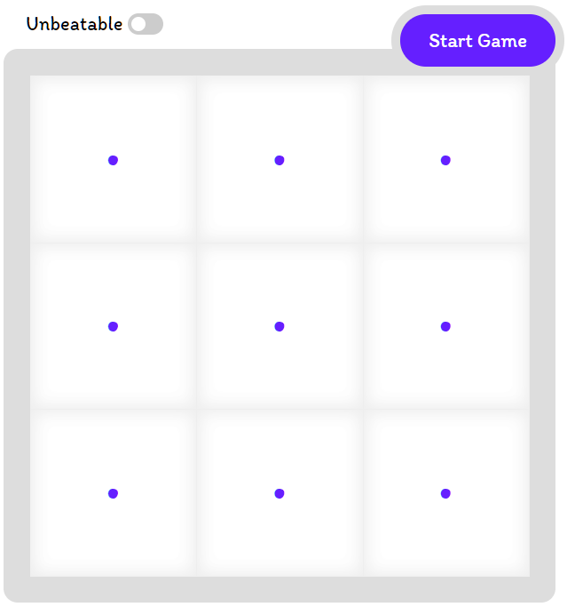

# Tic-Tac-Toe Game

This simple app is built with Vanilla JS, HTML and CSS.

Module and Factory pattern is used.

* DOM manipulation
* Events
* AI Logic (Beatable and Unbeatable)

[demo](https://ftekmen.github.io/tictactoe/)

